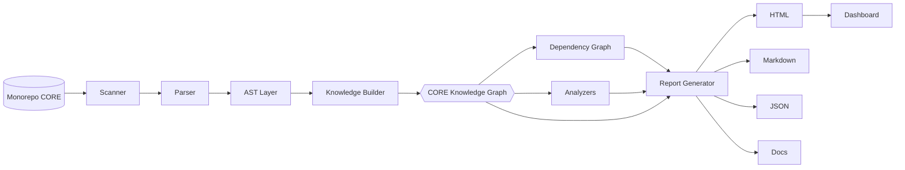

# ROADMAP-002-ANALYZER

**Producto:** CORE Analyzer
**Tipo:** Herramienta del ecosistema CORE (`tools/core-analyzer`)
**Depende de:** `ROADMAP-000-FOUNDATION`, `ROADMAP-001-FOUNDATION` (aprobados)
**Estado del documento:** Especificación técnica completa para aprobación
**Autor del rol:** Principal Software Architect
**Versión:** 0.1.0

---

## Resumen ejecutivo

CORE Analyzer es la herramienta que **analiza automáticamente el ecosistema CORE** y produce conocimiento estructurado sobre él: inventario, grafo de dependencias, matriz de reutilización, análisis de imports/exports, detección de código muerto y documentación generada. No es un linter más: es un **motor de conocimiento y enforcement** que valida que el monorepo cumpla las decisiones de arquitectura establecidas en ROADMAP-000 y ROADMAP-001.

Relación directa con fases previas: las **acciones de auditoría manuales** que ROADMAP-001 asignó a cada paquete (inventariar, detectar bypass de Supabase, verificar el grafo acíclico, confirmar la matriz de reutilización) pasan a ser **automatizables y verificables en CI** mediante CORE Analyzer. Las ADR-101 a ADR-106 se transforman de "acuerdos" en **reglas ejecutables**.

**Ubicación:** `tools/core-analyzer`, consistente con la regla del monorepo (`tools/*` para tooling/CLIs). Se consume y ejecuta desde la raíz, respetando el lockfile único y `workspace:*`.

---

## 1. Arquitectura

CORE Analyzer es un **pipeline de fases puras** que transforma el repositorio en un modelo de conocimiento consultable y, desde ese modelo, genera todos los reportes. El principio rector: **una sola pasada de extracción, muchas vistas derivadas**.

**Principios de arquitectura:**
- **Determinismo:** misma entrada → misma salida (clave para diffs y CI).
- **Modelo intermedio único** (CORE Knowledge Graph) del que todo deriva.
- **Fases desacopladas:** scanner/parser/analizadores/reporteros son reemplazables.
- **Sin efectos secundarios sobre el repo:** sólo lee; escribe únicamente en su directorio de salida.
- **Extensibilidad de primera clase:** analizadores y reporteros son plugins (sección 18).

**Modelo de ejecución:** CLI single-shot (un comando = una corrida del pipeline hasta la fase pedida), con caché incremental opcional basada en hashes de archivo/manifiesto para acelerar corridas repetidas.

---

## 2. CLI

Interfaz de línea de comandos, ejecutable desde la raíz del monorepo (`C:\CORE`).

**Comandos principales:**

| Comando | Función |
|---|---|
| `scan` | Descubre el workspace y produce el inventario crudo |
| `analyze` | Ejecuta scanner→parser→knowledge builder y todos los analizadores |
| `graph` | Genera el grafo de dependencias (paquete y módulo) |
| `report` | Genera reportes en los formatos solicitados (HTML/MD/JSON) |
| `doc` | Genera/actualiza documentación derivada (inventario, matriz, API) |
| `dashboard` | Sirve o construye el dashboard interactivo |
| `check` | Ejecuta reglas en modo verificación; **código de salida ≠ 0 si hay violaciones** (modo CI) |

**Flags transversales (selección):**
- `--root <path>` (por defecto la raíz detectada vía `pnpm-workspace.yaml`).
- `--format html,md,json` (uno o varios).
- `--out <dir>` (directorio de salida; nunca dentro de paquetes auditados).
- `--include / --exclude <glob>`.
- `--rules <set>` y `--fail-on <severity>` (para `check`).
- `--cache / --no-cache`.
- `--config <file>`.

**Archivo de configuración:** `core-analyzer.config` en la raíz — define rutas, reglas activas, severidades, reporteros, umbrales y plugins. La configuración del repo prevalece sobre los defaults; los flags prevalecen sobre el archivo.

**Códigos de salida (contrato CI):**
- `0` éxito sin violaciones.
- `1` violaciones de severidad ≥ umbral (`--fail-on`).
- `2` error de ejecución (config inválida, repo no detectado).

---

## 3. Scanner

Responsable del **descubrimiento** del ecosistema.

- Lee `pnpm-workspace.yaml` y resuelve los globs (`apps/*`, `packages/*`, `tools/*`) como fuente de verdad del workspace (consistente con la config oficial: la definición del workspace pertenece a `pnpm-workspace.yaml`).
- Recorre el árbol de archivos respetando `.gitignore`, `node_modules`, `dist` y exclusiones configuradas.
- Clasifica cada unidad como **app / package / tool** y cada archivo por tipo (TS/JS, JSON, YAML, manifiesto).
- Lee cada `package.json` (nombre, versión, `dependencies`, `peerDependencies`, exports/entry points, `private`).
- Lee el `pnpm-lock.yaml` raíz y detecta lockfiles indebidos en `apps/*`, `packages/*`, `tools/*` (regla del monorepo: lockfile único).

**Salida:** inventario crudo (lista de unidades, archivos y manifiestos) que alimenta al Parser.

---

## 4. Parser

Convierte el contenido crudo en representaciones estructuradas, por tipo de archivo.

- **TypeScript/JavaScript:** parseo a AST (sección 5) con resolución de módulos (alias de TS, `workspace:*`, paths del monorepo).
- **Manifiestos (`package.json`):** extracción de dependencias declaradas, exports y metadatos.
- **`pnpm-workspace.yaml` / `turbo.json` / `vercel.json`:** parseo para entender topología, pipelines de build y configuración de despliegue.
- **Resolución de módulos:** distingue import interno (`@core-*`, `workspace:*`) de externo (npm) y detecta referencias prohibidas `file:../../...` (ADR-106 / regla del monorepo).

**Salida:** árbol sintáctico + manifiestos normalizados, listos para el AST Layer y el Knowledge Builder.

---

## 5. AST (capa de árbol sintáctico)

Capa que **normaliza** los ASTs de TS/JS a un modelo de nodos estable e independiente del parser concreto.

**Qué extrae por archivo:**
- **Imports:** especificador, símbolos importados, tipo (default/named/namespace/side-effect), si es interno o externo, y si es *deep import* (entra por debajo del entry point público).
- **Exports:** símbolos exportados, re-exports/barrels, exports por defecto, superficie pública.
- **Declaraciones:** funciones, componentes, tipos, constantes (para inventario de API y análisis de uso).
- **Referencias de uso:** llamadas/usos relevantes para reglas (p. ej. instanciación del cliente Supabase, uso de tokens de diseño, lectura de variables de entorno con secretos).

**Garantía:** el modelo de nodos es estable aunque cambie el parser subyacente; los analizadores trabajan contra este modelo, no contra el AST crudo.

---

## 6. Knowledge Builder

Ensambla toda la extracción en el **CORE Knowledge Graph (CKG)**: el modelo intermedio único del que derivan todas las vistas y reportes.

**Nodos:**
- Workspace, App, Package, Tool, Module (archivo), Symbol (export/declaración), Dependency (interna/externa).

**Aristas:**
- `depends_on` (paquete→paquete, según manifiestos).
- `imports` (módulo→módulo/símbolo, según AST).
- `exports` (módulo→símbolo).
- `uses_token`, `instantiates_supabase`, `reads_secret` (aristas semánticas para reglas).
- `belongs_to` (módulo→unidad; símbolo→módulo).

**Propiedades:** capa arquitectónica del paquete (0–3 de ROADMAP-001), visibilidad (pública/interna), versión, métricas (tamaño, fan-in/fan-out).

El CKG es **consultable** (por los analizadores y por el motor de reglas) y **serializable a JSON** (sección 16) como fuente de verdad exportable.

---

## 7. Dependency Graph

Vista derivada del CKG enfocada en dependencias.

**Niveles:**
- **Grafo de paquetes** (a partir de `package.json` + imports reales).
- **Grafo de módulos** (archivo a archivo).

**Capacidades:**
- **Detección de ciclos** a nivel paquete y módulo (enforcement de ADR-101: grafo acíclico).
- **Validación de capas** (0→3 de ROADMAP-001): marca toda dependencia ascendente como violación.
- **Declaradas vs reales:** dependencias declaradas en el manifiesto pero no usadas (*unused*), y usadas pero no declaradas (*phantom/undeclared*).
- **Internas vs externas** y **consistencia de versiones** de dependencias externas entre paquetes (version skew).
- **Coherencia con lockfile:** detecta lockfiles parciales prohibidos y referencias `file:` (regla del monorepo + ADR-106).
- **Métricas de acoplamiento:** fan-in / fan-out, paquetes inestables, candidatos a "god package" (relevante para `@core-shell`, ADR-104).

**Salida:** grafo navegable (para dashboard), exportable a formatos de grafo y a JSON.

---

## 8. Analizadores (módulos de análisis)

Cada análisis es un módulo que consulta el CKG y emite hallazgos con severidad.

### 8.1 Análisis de dependencias
Ciclos, violaciones de capa, dependencias no usadas, fantasma, version skew, lockfiles indebidos, referencias `file:`. (Detalle en sección 7.)

### 8.2 Análisis de imports
- Imports internos vs externos por unidad.
- **Deep imports** que evaden el entry point público de un paquete (rompen el contrato de API de ROADMAP-001).
- **Imports prohibidos por regla de arquitectura:** p. ej. cualquier import/instanciación de Supabase fuera de `@core-bep-supabase` (ADR-102); lectura de secretos fuera de `@core-apivault` (ADR-105); uso de valores visuales crudos en vez de tokens (ADR-103).
- Imports cruzados que violan la dirección de capas.

### 8.3 Análisis de exports
- **Superficie de API pública** por paquete (qué exporta realmente).
- **Exports no usados** por ningún consumidor del ecosistema (candidatos a reducir API).
- Análisis de **barrels/re-exports** y exports duplicados.
- **Estabilidad de API:** comparación de la superficie pública entre corridas (detección de breaking changes) para el versionado semántico de los paquetes base.

### 8.4 Análisis de código muerto
- **Módulos huérfanos:** archivos inalcanzables desde cualquier entry point de app/tool.
- **Exports muertos:** símbolos exportados nunca importados en todo el ecosistema.
- **Ramas inalcanzables** desde los grafos de la sección 7.
- Diferenciación entre muerto real y "API pública intencionalmente no consumida aún" (configurable, para no penalizar paquetes base nuevos).

### 8.5 Inventario automático
Catálogo completo: apps, packages, tools; sus manifiestos, versiones, exports, métricas y capa arquitectónica. Es la versión automatizada del inventario que ROADMAP-001 pedía hacer a mano.

### 8.6 Matriz de reutilización
Genera automáticamente la matriz **paquete × aplicación** (qué app usa qué paquete), derivada de dependencias declaradas **y** de imports reales. Automatiza y mantiene viva la matriz que ROADMAP-001 produjo manualmente, e incluye la matriz inter-paquete.

---

## 9. Generación de documentación

CORE Analyzer produce **documentación derivada del CKG**, siempre reproducible (doc-as-code):

- **Inventario** del ecosistema.
- **Matriz de reutilización** (paquete×app e inter-paquete).
- **Superficie de API pública** por paquete.
- **Grafo de dependencias** renderizado.
- **Hallazgos** de los analizadores (con severidad y ubicación).
- Capacidad de **refrescar** secciones de documentos de gobierno (p. ej. regenerar la matriz dentro de un ROADMAP-NNN) a partir del estado real del repo.

La documentación generada nunca se edita a mano: se regenera desde el modelo, garantizando que no se desactualice respecto del código.

---

## 10. Report Generator

Capa de renderizado **pluggable**: toma el CKG + hallazgos y delega en reporteros por formato. Cada reportero es independiente y seleccionable por CLI (`--format`).

Reglas: el contenido (modelo) está separado de la presentación (reportero); agregar un formato nuevo no toca los analizadores.

### 10.1 Reportes HTML
Reporte rico, autocontenido y navegable: inventario, matriz, grafo interactivo, hallazgos filtrables por severidad/unidad. Pensado para revisión humana. Opcionalmente adopta los tokens de `@core-design` para coherencia visual con el ecosistema (sin acoplarse: si no están disponibles, usa un tema neutro embebido).

### 10.2 Reportes Markdown
Salida amigable para PRs y para documentación versionada: tablas de inventario y matriz, lista de hallazgos, resumen de grafo. Ideal para incrustar en ROADMAP-NNN y para comentarios automáticos en pull requests.

### 10.3 Reportes JSON
**Fuente de verdad machine-readable:** serialización del CKG y de los hallazgos. Consumible por CI (gates), por el Dashboard, por CORE Roadmap (para alimentar Insights) y por integraciones externas. Esquema estable y versionado.

---

## 11. Dashboard

Visualización interactiva construida sobre el reporte HTML/JSON.

- **Vistas:** inventario, grafo de dependencias navegable (zoom a paquete/módulo), matriz de reutilización, hallazgos filtrables, evolución entre corridas.
- **Modos:** estático (build a `dist`, desplegable como cualquier app del ecosistema vía Vercel por filtros) o servido localmente para inspección.
- **Reutilización visual:** puede consumir `@core-design`/`@core-ui` para coherencia, manteniéndose como salida autocontenida.
- **Integración futura:** el dashboard puede alimentar el módulo Insights de CORE Roadmap mediante el JSON canónico.

---

## 12. Modelo de extensibilidad

CORE Analyzer es extensible por diseño. Tres puntos de extensión, todos declarados en `core-analyzer.config`:

1. **Analizadores (plugins):** módulos que consultan el CKG y emiten hallazgos. Permiten agregar nuevos análisis sin tocar el core.
2. **Reglas (rule engine):** reglas estilo lint sobre el CKG, con severidad configurable. Las **ADR del ecosistema se implementan como reglas** (Supabase sólo en bep, secretos sólo en vault, sin ciclos, sin `file:`, theming por tokens, shell sin lógica). Cada repo puede activar/desactivar/ajustar severidades.
3. **Reporteros (renderers):** nuevos formatos de salida sin modificar analizadores.

**Contrato de plugin (conceptual):** cada plugin declara su tipo (analyzer/rule/reporter), sus entradas (qué consulta del CKG) y sus salidas (hallazgos o artefactos). El core garantiza orden de ejecución determinista y aislamiento (un plugin no muta el CKG).

**Conjuntos de reglas (rule sets):** `core-foundation` (ADR-101 a ADR-106), `recommended`, `strict`. Seleccionables por CLI/config.

---

## 13. Integración con el ecosistema y CI/CD

- **Enforcement en CI:** `core-analyzer check --rules core-foundation --fail-on error` se ejecuta en el pipeline; un hallazgo crítico **bloquea el merge/deploy**. Esto convierte las ADR de ROADMAP-000/001 en garantías ejecutables.
- **Comentario en PR:** salida Markdown publicada como comentario (diff de hallazgos respecto a la base).
- **Alimentación de CORE Roadmap:** el JSON canónico nutre el módulo Insights (trazabilidad y salud del ecosistema).
- **Respeto del monorepo:** se instala/ejecuta desde la raíz, sin lockfiles propios, consumiendo dependencias vía `workspace:*`; no introduce infraestructura nueva.

---

## 14. Decisiones de arquitectura de esta fase (ADR)

- **ADR-201:** CORE Analyzer vive en `tools/core-analyzer` (es tooling/CLI, no app de usuario).
- **ADR-202:** El **CORE Knowledge Graph** es el único modelo intermedio; toda vista/reporte deriva de él.
- **ADR-203:** El pipeline es determinista y sin efectos secundarios sobre el repo (sólo lee; escribe sólo en `--out`).
- **ADR-204:** Las ADR del ecosistema se implementan como **reglas ejecutables** (rule set `core-foundation`), verificables en CI.
- **ADR-205:** Presentación desacoplada del modelo: analizadores y reporteros son independientes y pluggables.
- **ADR-206:** El JSON de salida es la fuente de verdad machine-readable, con esquema versionado, y es el contrato de integración con CORE Roadmap y CI.

---

## 15. Criterios de finalización de ROADMAP-002

La fase se considera cerrada cuando la especificación permite, sin ambigüedad:

1. Construir el pipeline Scanner→Parser→AST→Knowledge Builder→CKG.
2. Derivar Dependency Graph y los analizadores (dependencias, imports, exports, código muerto, inventario, matriz de reutilización).
3. Generar reportes en HTML, Markdown y JSON, y el Dashboard.
4. Ejecutar el modo `check` en CI con el rule set `core-foundation` (enforcement de ADR-101 a ADR-106 y ADR-201 a ADR-206).
5. Extender el sistema vía plugins (analizadores, reglas, reporteros) sin tocar el core.

**Siguiente fase habilitada:** `ROADMAP-003`.

---

## Nota de método

CORE Analyzer opera sobre el repositorio real (`C:\CORE`), cuyo contenido no se inspecciona en este documento; por lo tanto, esta especificación define **el comportamiento y los contratos** de la herramienta, no resultados concretos del análisis. Los resultados reales (inventario, matriz, hallazgos) los produce la herramienta al ejecutarse sobre el monorepo.
