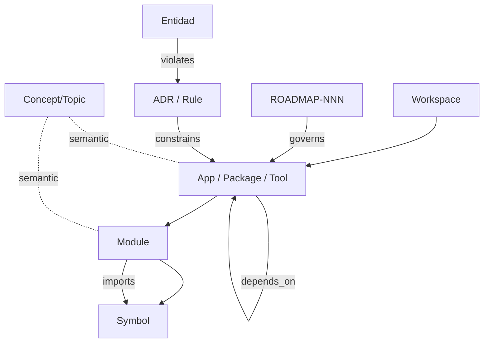

# ROADMAP-003-KNOWLEDGE-GRAPH

**Componente:** CORE Knowledge Graph (CKG)
**Tipo:** Capa de conocimiento del ecosistema CORE (servicio sobre `@core-bep-supabase`)
**Depende de:** `ROADMAP-000`, `ROADMAP-001`, `ROADMAP-002` (aprobados)
**Estado del documento:** Especificación técnica completa para aprobación
**Autor del rol:** Principal Software Architect
**Versión:** 0.1.0

---

## Resumen ejecutivo

El CORE Knowledge Graph convierte **todo el ecosistema CORE en un grafo de conocimiento consultable**: paquetes, apps, tools, módulos, símbolos, dependencias, documentos de gobierno (ROADMAP-NNN), ADR, tokens de diseño y sus relaciones, enriquecidos con una capa semántica (embeddings + RAG).

En ROADMAP-002 el CKG era el modelo intermedio en memoria del Analyzer, recalculado por corrida. Esta fase lo **promueve a una capa persistente, versionada y multi-consumidor**: el Analyzer lo **produce**; Biblioteca, Orquesta y CORE Roadmap lo **consumen**; `@core-bep-supabase` es su **vía de acceso**. El CKG pasa de ser un detalle interno a ser el **sustrato de conocimiento** del ecosistema.

**Principio rector:** una sola fuente de verdad estructural y semántica del ecosistema, escrita por un único productor determinista y leída por muchos.

---

## Nota de método y forward references

- **Biblioteca** y **Orquesta** no fueron especificadas en fases previas. Este documento define **el contrato del CKG hacia ellas** (qué expone y qué espera), no su diseño interno, que corresponde a sus propias fases. Donde se describen, se asume un rol mínimo y coherente con el ecosistema, marcado como *forward reference*.
- El CKG opera sobre el repositorio y el backend reales, no inspeccionados aquí; por tanto esta especificación define **modelo, contratos y comportamiento**, no datos concretos.

---

## 1. Modelo conceptual

El modelo conceptual describe **qué conocimiento representa el CKG**, independientemente de su implementación. Es la **ontología del ecosistema CORE**.

El ecosistema se entiende como un grafo donde:
- Las **unidades** (apps, packages, tools) contienen **módulos**, que declaran y consumen **símbolos**.
- Las unidades **dependen** entre sí y los módulos **importan/exportan** símbolos.
- Las **decisiones de arquitectura (ADR)** y los **documentos de gobierno (ROADMAP-NNN)** *gobiernan* a las unidades; las violaciones detectadas relacionan entidades con reglas.
- Una **capa semántica** superpone *conceptos/temas* y vínculos de *similitud* derivados de embeddings, conectando lo estructural con lo significativo.

El modelo conceptual es **estable y agnóstico**: los demás modelos (lógico, físico) lo realizan sin alterar su semántica.

---

## 2. Modelo lógico

El modelo lógico realiza la ontología como un **grafo de propiedades** (property graph) mapeable a un motor relacional, sin atarse todavía al físico.

**Estructuras centrales:**
- **Node:** `id`, `type`, `qualified_name`, `unit`, `layer` (0–3 de ROADMAP-001), `visibility` (pública/interna), `properties` (JSON), `workspace_id`, `snapshot_id`.
- **Edge:** `id`, `type`, `from_node`, `to_node`, `properties` (JSON), `workspace_id`, `snapshot_id`.
- **Embedding:** `node_id`, `vector`, `model`, `snapshot_id`.
- **Snapshot:** `id`, `git_sha`, `created_at`, `producer_version`, `status` (versionado, sección 6).
- **Finding:** hallazgos del Analyzer ligados a nodos/edges y a reglas/ADR (puente con ROADMAP-002).

**Garantías lógicas:**
- Todo nodo/arista pertenece a un **snapshot** (grafo versionado) y a un **workspace** (multi-tenant).
- Las propiedades flexibles van en JSON; las consultadas con frecuencia se promueven a columnas indexadas.
- El grafo es **dirigido y tipado**; los tipos provienen de las taxonomías de las secciones 3 y 4.

---

## 3. Tipos de nodos

| Tipo de nodo | Representa | Origen |
|---|---|---|
| `Workspace` | Tenant / ecosistema | Scanner |
| `App` | Aplicación (`apps/*`) | Scanner |
| `Package` | Paquete (`packages/*`) | Scanner |
| `Tool` | Herramienta (`tools/*`) | Scanner |
| `Module` | Archivo/módulo | Parser/AST |
| `Symbol` | Export o declaración (función, componente, tipo, const) | AST |
| `Dependency` | Dependencia externa (npm) | Manifiestos |
| `Token` | Token de diseño (`@core-design`) | AST/análisis |
| `RoadmapDoc` | Fase de gobierno ROADMAP-NNN | Gobierno/CORE Roadmap |
| `ADR` | Decisión de arquitectura / regla | Gobierno/Analyzer |
| `Finding` | Hallazgo del Analyzer | Analyzer |
| `Concept` | Tema/concepto semántico | Capa semántica (embeddings) |

Los tipos son extensibles vía el modelo de plugins heredado de ROADMAP-002 (un plugin puede aportar nuevos tipos de nodo, sección de extensibilidad de aquel doc).

---

## 4. Tipos de relaciones

| Tipo de arista | De → A | Semántica |
|---|---|---|
| `contains` | Unit → Module / Module → Symbol | Composición estructural |
| `depends_on` | Unit → Unit | Dependencia declarada (manifiesto) |
| `imports` | Module → Symbol/Module | Import real (AST) |
| `exports` | Module → Symbol | Superficie pública |
| `uses_token` | Module → Token | Consumo de diseño (enforcement ADR-103) |
| `instantiates_supabase` | Module → (marcador) | Detección de bypass (ADR-102) |
| `reads_secret` | Module → (marcador) | Detección de secretos fuera de vault (ADR-105) |
| `governs` | RoadmapDoc → Unit | Gobierno de fase sobre entidades |
| `constrains` | ADR → Unit/Module | Regla aplicable a una entidad |
| `violates` | Entidad → ADR | Violación detectada |
| `documents` | RoadmapDoc/Module → Unit/Symbol | Documentación asociada |
| `similar_to` | Node → Node | Vínculo semántico (embeddings) |
| `references` | RoadmapDoc → RoadmapDoc / Initiative → Symbol | Trazabilidad (puente con CORE Roadmap) |

`depends_on`/`imports`/`exports` realizan el grafo de dependencias de ROADMAP-002; `governs`/`references` realizan la trazabilidad estrategia↔código de ROADMAP-000; `similar_to` es la capa semántica nueva de esta fase.

---

## 5. Persistencia

**Decisión (ADR-301):** el CKG se persiste en **Postgres sobre Supabase existente**, accedido **exclusivamente vía `@core-bep-supabase`**. No se introduce una base de grafos dedicada.

**Justificación:**
- Cumple "no inventar infraestructura" (ROADMAP-000) y centraliza el acceso a datos (ADR-102/ROADMAP-001).
- Postgres cubre las necesidades: tablas `nodes`/`edges` con propiedades en `JSONB`, **CTEs recursivas** para traversal, índices por `type`/`qualified_name`/`workspace_id`/`snapshot_id`, y **`pgvector`** para la capa semántica (secciones 13–15).
- Multi-tenant nativo vía **RLS** por `workspace_id`, coherente con todo el ecosistema.

**Esquema lógico (resumen):** tablas `ckg_snapshots`, `ckg_nodes`, `ckg_edges`, `ckg_embeddings`, `ckg_findings`. Índices: B-tree sobre claves de consulta; GIN sobre `JSONB` de propiedades; índice vectorial (HNSW/IVFFlat) sobre embeddings.

**Umbral de revisión (registrado):** si el traversal a gran profundidad sobre grafos de módulos muy grandes degrada el rendimiento de las CTEs recursivas más allá del SLA, se evaluará una proyección/caché de grafo o un motor especializado **como decisión futura justificada**, no como punto de partida.

---

## 6. Versionado

El CKG es un **grafo versionado por snapshots**, alineado al determinismo del Analyzer (ADR-203 de ROADMAP-002).

- Cada corrida del Analyzer produce un **snapshot** identificado por `git_sha` + `producer_version`.
- Nodos, aristas y embeddings se etiquetan con su `snapshot_id`: el grafo es **inmutable por snapshot** (append-only), no se sobre-escribe.
- **Diffs entre snapshots:** altas/bajas de nodos y aristas, cambios de superficie de API, nuevas violaciones de ADR, evolución de la matriz de reutilización. Habilita "qué cambió entre dos commits/fases".
- **Snapshot activo:** puntero al snapshot vigente por workspace; los consumidores leen el activo salvo que pidan uno histórico.
- **Retención:** política configurable (p. ej. conservar snapshots de fases ROADMAP-NNN cerradas y los últimos N de CI).

El versionado es lo que permite a CORE Roadmap mostrar la **evolución de la salud del ecosistema** y atar cambios estructurales a fases de gobierno.

---

## 7. Sincronización

Modelo **productor único → consumidores múltiples**, con escritura controlada.

- **Productor único:** CORE Analyzer es el **único escritor** del CKG (coherente con ADR-202/203). Ningún consumidor escribe nodos/aristas estructurales.
- **Disparadores:** corrida en CI al merge a la rama principal (snapshot canónico), corridas manuales (snapshots etiquetados), y opcional incremental local.
- **Carga:** el Analyzer emite su **JSON canónico** (ADR-206) y un *loader* lo materializa en las tablas del CKG vía `@core-bep-supabase`, dentro de una transacción que crea el snapshot completo antes de activarlo (consistencia: nunca un snapshot a medias).
- **Incrementalidad:** basada en hashes de archivo/manifiesto (heredada del Analyzer); sólo se recomputan unidades cambiadas, pero el snapshot resultante es siempre coherente y completo.
- **Capa semántica:** tras materializar el snapshot, un job de embeddings (Edge Function) genera/actualiza vectores para nodos nuevos o modificados (sección 14).

---

## 8. Integración con Analyzer

Relación **productor**. (Forward/backward reference a ROADMAP-002.)

- El Analyzer construye el CKG en memoria y lo **serializa al JSON canónico**; el loader del CKG lo persiste como snapshot.
- Los **Findings** y el rule set `core-foundation` (ADR-204) se persisten como nodos/aristas (`Finding`, `violates`), de modo que las violaciones de ADR quedan **consultables históricamente**, no sólo en la salida de una corrida.
- El esquema JSON del Analyzer y el esquema del CKG comparten contrato versionado: cambiar uno obliga a versionar el otro.

---

## 9. Integración con Biblioteca

Relación **consumidor de lectura**. *(Forward reference: Biblioteca se especifica en su propia fase.)*

Rol asumido de **Biblioteca**: el catálogo/portal curado de activos reutilizables del ecosistema (paquetes, componentes de `@core-ui`, APIs públicas, tokens, documentación).

Contrato del CKG hacia Biblioteca:
- Expone el **inventario** y la **superficie de API pública** por paquete (qué exporta cada uno, con su capa y visibilidad).
- Expone la **matriz de reutilización** (qué app usa qué) para mostrar adopción/popularidad de cada activo.
- Habilita **búsqueda semántica** (sección 13) para que Biblioteca permita "encontrar el componente/paquete que hace X".
- Provee `documents`/`similar_to` para enlazar un activo con su documentación y con activos relacionados.

Biblioteca **sólo lee**; no muta el grafo.

---

## 10. Integración con Orquesta

Relación **consumidor de razonamiento/acción**. *(Forward reference: Orquesta se especifica en su propia fase.)*

Rol asumido de **Orquesta**: la capa de orquestación/automatización (workflows y/o agentes de IA) que razona y actúa sobre el ecosistema.

Contrato del CKG hacia Orquesta:
- Provee **contexto estructural fundamentado** para agentes: dependencias, impacto, violaciones de ADR, superficie de API.
- Provee el **motor RAG** (sección 15) para respuestas y decisiones ancladas en el estado real del repo (no alucinadas).
- Expone consultas de **análisis de impacto** ("si cambio este símbolo, qué se ve afectado") para que Orquesta planifique acciones seguras.
- Las **credenciales de IA** que Orquesta necesite se resuelven vía `@core-apivault` (ADR-105), nunca embebidas.

Orquesta **lee** el grafo; cualquier escritura que produzca (p. ej. anotaciones) va por una vía controlada y auditada, separada del flujo estructural del Analyzer.

---

## 11. Integración con BEP (`@core-bep-supabase`)

Relación **vía de acceso única**.

- Todo acceso de lectura/escritura al CKG pasa por `@core-bep-supabase` (ADR-102): cliente tipado, RLS-aware, invocación de Edge Functions y suscripción Realtime.
- El **esquema del CKG** se incorpora a los tipos generados de BEP, de modo que los consumidores acceden con tipado fuerte.
- Las **operaciones de traversal** (CTEs recursivas) y las de **similitud vectorial** se exponen como RPCs/funciones de Postgres a través de BEP, no como queries ad-hoc dispersas.
- **Realtime** permite a los consumidores (CORE Roadmap, dashboards) reaccionar a la activación de un nuevo snapshot.

---

## 12. Consultas

El CKG ofrece una **capa de consulta estructural** sobre el grafo, expuesta vía BEP.

**Categorías de consulta:**
- **Inventario y catálogo:** unidades, módulos, símbolos, con filtros por tipo/capa/visibilidad.
- **Dependencias:** dependientes/dependencias directas e indirectas; detección de ciclos; validación de capas (ADR-101).
- **Imports/Exports:** consumidores de un símbolo; deep imports; exports no usados.
- **Trazabilidad/Gobierno:** qué ROADMAP-NNN gobierna qué; qué entidades violan qué ADR; referencias entre fases.
- **Análisis de impacto:** *blast radius* de cambiar un símbolo/módulo (transitivo).
- **Diff entre snapshots:** qué cambió entre dos versiones (sección 6).

**Mecánica:** traversal mediante CTEs recursivas con cortes de profundidad y filtros por `snapshot_id`/`workspace_id`; resultados paginados; consultas frecuentes encapsuladas como RPCs estables (no SQL libre en los consumidores).

---

## 13. Búsqueda semántica

Capa que complementa las consultas estructurales con **recuperación por significado**.

- Permite consultas en lenguaje natural sobre el ecosistema ("paquete que maneja autenticación", "dónde se formatean monedas").
- Combina **recuperación vectorial** (sección 14) con **filtros estructurales** del grafo (por tipo, capa, unidad), evitando resultados fuera de contexto.
- Resultados rankeados por similitud y reforzados por señales estructurales (fan-in, visibilidad pública, adopción según matriz de reutilización).
- Es la base para Biblioteca (descubrimiento de activos) y para el RAG de Orquesta/CORE Roadmap.

---

## 14. Embeddings

- **Qué se embebe:** nodos con contenido significativo — `Package`, `Module`, `Symbol`, `RoadmapDoc`, `ADR`, `Concept` — usando un texto canónico por nodo (nombre cualificado + documentación + señales estructurales resumidas).
- **Almacenamiento:** tabla `ckg_embeddings` con `pgvector`, etiquetada por `snapshot_id` y `model` (versionado de embeddings junto al grafo).
- **Generación:** vía la **capa de IA agnóstica de proveedor** (Anthropic/OpenAI) definida en ROADMAP-000, ejecutada en **Edge Functions**, con claves resueltas por **`@core-apivault`** (ADR-105). El proveedor/modelo de embeddings es configurable por workspace.
- **Actualización:** incremental tras cada snapshot (sólo nodos nuevos/cambiados), para controlar costo.
- **Índice:** HNSW/IVFFlat para búsqueda aproximada de vecinos a escala.
- Los vínculos `similar_to` del grafo pueden derivarse de la vecindad vectorial, uniendo capa semántica y estructural.

---

## 15. Modelo RAG

El CKG ofrece **Retrieval-Augmented Generation fundamentado en el grafo** (estilo GraphRAG): combina recuperación semántica con traversal estructural para dar contexto verificable a los modelos.

**Flujo conceptual:**
1. **Recuperación híbrida:** la consulta se embebe y recupera nodos semánticamente cercanos (sección 13), acotada por filtros estructurales.
2. **Expansión por grafo:** desde los nodos recuperados se expande por relaciones relevantes (`depends_on`, `imports`, `documents`, `governs`) para traer contexto vecino fundamentado.
3. **Construcción de contexto:** se arma un contexto compacto con evidencia (nodos, aristas, fragmentos de doc) y sus **referencias trazables** al repo/fase.
4. **Generación:** el modelo (Anthropic/OpenAI, vía ApiVault, en Edge Function) responde **anclado** a ese contexto; las afirmaciones citan nodos del CKG.

**Garantías:** respuestas trazables al estado real del ecosistema y a un `snapshot_id` concreto (reproducibilidad); reducción de alucinación por anclaje estructural. Consumidores: Orquesta (razonamiento/acción), CORE Roadmap (AI Studio/Insights), Biblioteca (descubrimiento explicado).

---

## 16. Escalabilidad

- **Lecturas dominantes:** patrón productor-único/lectores-múltiples; se escala con réplicas de lectura y caché de consultas frecuentes (RPCs estables).
- **Particionado por snapshot/workspace:** las tablas se particionan/indexan por `snapshot_id` y `workspace_id`; las consultas siempre acotan por snapshot activo, limitando el conjunto de trabajo.
- **Traversal acotado:** profundidad y fan-out limitados por defecto; consultas de impacto con cortes y paginación.
- **Vectorial a escala:** índices aproximados (HNSW) y embeddings incrementales para contener costo y latencia.
- **Retención:** poda de snapshots antiguos (sección 6) para mantener el tamaño bajo control.
- **Umbral de motor especializado (ADR-301):** sólo si las CTEs recursivas dejan de cumplir el SLA en grafos de módulos muy grandes, se evalúa proyección de grafo o motor dedicado, como evolución justificada.

---

## 17. Seguridad

- **Multi-tenant por RLS:** todo nodo/arista/embedding lleva `workspace_id`; las políticas RLS garantizan aislamiento entre tenants (coherente con ROADMAP-000/001).
- **Acceso único vía BEP** (ADR-102): sin clientes Supabase paralelos; clave de servicio nunca en el frontend.
- **Escritura restringida:** sólo el loader del Analyzer (proceso de CI con rol de servicio) escribe estructura; los consumidores son de lectura.
- **Credenciales vía ApiVault** (ADR-105): claves de IA/embeddings/servicio resueltas del lado servidor, nunca embebidas ni en logs.
- **RAG con permisos:** la recuperación respeta el `workspace_id` y la visibilidad de los nodos; un consumidor no recibe contexto fuera de su alcance.
- **Auditoría:** operaciones de escritura y consultas sensibles registradas, alineadas con el modelo de auditoría de CORE Roadmap.

---

## 18. Decisiones de arquitectura de esta fase (ADR)

- **ADR-301:** El CKG se persiste en Postgres/Supabase (tablas nodo/arista + CTEs recursivas + `pgvector`), no en una base de grafos dedicada; revisión sólo ante incumplimiento de SLA.
- **ADR-302:** El CKG es **versionado por snapshots** (inmutable por snapshot, ligado a `git_sha`), habilitando diffs y reproducibilidad.
- **ADR-303:** **Productor único** (Analyzer) y **lectores múltiples** (Biblioteca, Orquesta, CORE Roadmap); ningún consumidor escribe estructura.
- **ADR-304:** Acceso exclusivo vía `@core-bep-supabase`; traversal y similitud expuestos como RPCs estables.
- **ADR-305:** Embeddings y RAG usan la capa de IA agnóstica (ROADMAP-000) con claves vía `@core-apivault` y ejecución en Edge Functions.
- **ADR-306:** RAG **fundamentado en el grafo** y anclado a `snapshot_id`; respuestas trazables y respetuosas de RLS/visibilidad.

---

## 19. Criterios de finalización de ROADMAP-003

La fase se cierra cuando la especificación permite, sin ambigüedad:

1. Materializar el modelo conceptual y lógico como grafo de propiedades en Supabase vía BEP.
2. Cargar snapshots versionados desde el JSON canónico del Analyzer (productor único).
3. Ejecutar consultas estructurales (inventario, dependencias, imports/exports, impacto, diffs).
4. Generar embeddings y servir búsqueda semántica y RAG fundamentado, con IA vía ApiVault.
5. Servir como capa de lectura para Biblioteca, Orquesta y CORE Roadmap, con RLS y auditoría.

**Siguiente fase habilitada:** `ROADMAP-004`.
