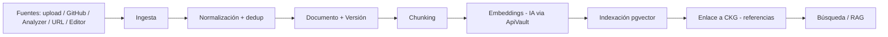

# ROADMAP-004-BIBLIOTECA

**Producto:** CORE Biblioteca — Centro de Conocimiento del ecosistema CORE
**Tipo:** Aplicación + servicio de conocimiento (`apps/core-biblioteca` + `@core/biblioteca-domain`)
**Depende de:** `ROADMAP-000`, `ROADMAP-001`, `ROADMAP-002`, `ROADMAP-003` (aprobados)
**Estado del documento:** Especificación técnica completa para aprobación
**Autor del rol:** Principal Software Architect
**Versión:** 0.1.0

---

## Resumen ejecutivo

CORE Biblioteca es el **Centro de Conocimiento** del ecosistema CORE: no un gestor documental tradicional, sino una **plataforma de conocimiento consultable** que ingiere, versiona, fragmenta (chunking), embebe y relaciona contenido de múltiples fuentes para servir búsqueda semántica, contextos curados y RAG fundamentado.

Mientras el **CKG (ROADMAP-003)** modela la *estructura del código* (paquetes, módulos, símbolos) y su semántica, **Biblioteca modela el *corpus de conocimiento* en prosa** (documentación, fuentes externas, contenido generado, conocimiento curado). Ambos se cruzan por referencias y se federan en la capa de recuperación, pero tienen responsabilidades distintas y no se solapan (ADR-401).

**Ubicación:** `apps/core-biblioteca` (centro de conocimiento de usuario) + `@core/biblioteca-domain` (contratos/dominio reutilizables), consumiendo los 7 paquetes base vía `workspace:*`. Backend en Supabase existente vía `@core-bep-supabase`. No se introduce infraestructura nueva.

---

## Nota de método y forward references

- **Editor**, **API Gateway** y **Orquesta** no están especificados en fases previas. Este documento define **el contrato de Biblioteca hacia ellos**, no su diseño interno (corresponde a sus propias fases). Marcados como *forward reference*.
- Biblioteca opera sobre backend y contenido reales, no inspeccionados aquí; la especificación define **modelo, contratos y comportamiento**.

---

## 1. Distinción Biblioteca ↔ Knowledge Graph (frontera de responsabilidad)

| Aspecto | CKG (ROADMAP-003) | Biblioteca (esta fase) |
|---|---|---|
| Modela | Estructura del código y su semántica | Corpus de conocimiento en prosa |
| Unidad central | Nodo (package/module/symbol) | Documento → versiones → chunks |
| Productor | Único: Analyzer | Múltiples fuentes (ingesta) |
| Escritura | Sólo Analyzer | Autores (vía Editor), ingestas, generados |
| Embeddings | De entidades de código | De chunks de documentos |
| Punto de unión | `documents`/`references` entre docs y nodos; **capa RAG federada** | idem |

**ADR-401:** CKG y Biblioteca son almacenes distintos con responsabilidades disjuntas; comparten la infraestructura `pgvector` vía BEP pero **no duplican** contenido. La recuperación RAG **federa** ambos; las referencias cruzadas los enlazan.

---

## 2. Visión y objetivo

Construir el lugar único donde **todo el conocimiento del ecosistema CORE vive, se versiona y se vuelve consultable**: documentación de productos, documentos de gobierno (ROADMAP-NNN), salidas del Analyzer, fuentes externas y conocimiento curado por equipos. El objetivo es eliminar el conocimiento disperso y darle a humanos (vía búsqueda/Editor) y a máquinas (vía RAG/Orquesta) una fuente fundamentada y trazable.

Nace **multi-tenant** y **SaaS-ready**, reutilizando la base CORE, para ser comercializable como centro de conocimiento independiente.

---

## 3. Modelo de dominio (entidades gestionadas)

### 3.1 Documentos
Unidad raíz del conocimiento. Cada documento tiene tipo (manual, guía, ADR, ROADMAP-NNN, fuente externa, generado), estado (borrador/publicado/archivado), `workspace_id` y metadata. No almacena sólo texto: es el ancla de versiones, chunks, relaciones y referencias.

### 3.2 Versiones
Cada documento es una **secuencia inmutable de versiones** (revisiones append-only) con autor, timestamp, diff respecto a la anterior y estado. Una nueva versión dispara **re-chunking y re-embedding** (sección 9). Permite rollback, comparación y trazabilidad temporal.

### 3.3 Chunks
Fragmentos recuperables de una versión de documento, producidos por la estrategia de chunking (por estructura/semántica, con solapamiento configurable). Cada chunk conserva su posición, su versión de origen y su metadata heredada. Es la unidad sobre la que operan embeddings y recuperación.

### 3.4 Embeddings
Vector por chunk, almacenado en `pgvector` vía BEP, etiquetado por `model` y por versión de documento (embeddings versionados junto al contenido). Generados por la **capa de IA agnóstica** (ROADMAP-000) con claves vía **`@core-apivault`**, en Edge Functions. Distintos de los embeddings de código del CKG (ADR-401).

### 3.5 Metadata
Atributos estructurados de documentos/versiones/chunks (autor, idioma, audiencia, dominio, sensibilidad, fuente, fechas). Consultables y filtrables; refuerzan la búsqueda y los permisos.

### 3.6 Relaciones
Vínculos entre documentos (deriva-de, complementa, reemplaza) y **referencias cruzadas al CKG** (un documento `documents` un paquete/símbolo). Forman un grafo de conocimiento de prosa que se conecta con el grafo estructural del CKG.

### 3.7 Etiquetas
Taxonomía de clasificación (jerárquica y/o libre) por workspace, para organizar, filtrar y curar. Base de la navegación y de los contextos.

### 3.8 Contextos
**Concepto distintivo:** un *contexto* es una colección curada y con alcance (por producto, audiencia, caso de uso) que define **una superficie de recuperación**. Sirve para acotar RAG ("responder usando sólo el contexto Onboarding"), para Orquesta (agentes con conocimiento delimitado) y para permisos. Un contexto agrupa documentos/etiquetas/fuentes bajo reglas.

### 3.9 Fuentes
Orígenes del conocimiento y sus **conectores de ingesta**: subidas manuales, repos GitHub (docs/markdown), salidas del Analyzer (inventario, matriz, API), URLs externas, y documentos creados en el Editor. Cada fuente define cómo se ingiere, con qué frecuencia y con qué metadata.

### 3.10 Referencias
**Trazabilidad y citación:** vínculos verificables desde un chunk/documento a su origen y, en RAG, citas que anclan cada afirmación a su fuente y versión. Garantiza respuestas auditables (coherente con el RAG fundamentado del CKG).

### 3.11 Búsquedas
Capacidad de consulta sobre todo el corpus: **híbrida** (semántica + léxica), filtrada por metadata/etiquetas/contexto, rankeada y paginada. Es la interfaz principal para humanos y la base de la recuperación para máquinas.

---

## 4. Arquitectura funcional

Capacidades de Biblioteca (qué hace):

1. **Ingesta** — conectores de fuentes, normalización, deduplicación.
2. **Procesamiento** — chunking + embedding + indexación + enlace al CKG.
3. **Gestión de conocimiento** — documentos, versiones, metadata, etiquetas, relaciones.
4. **Contextos** — creación y curación de superficies de recuperación con alcance.
5. **Búsqueda** — híbrida, filtrada, con citación.
6. **Recuperación para RAG** — provee contextos/chunks fundamentados a Orquesta y a CORE Roadmap.
7. **Autoría** — vía integración con Editor (forward ref).
8. **Exposición externa** — vía API Gateway (forward ref) para SaaS.
9. **Gobierno** — permisos, versionado, auditoría.

---

## 5. Arquitectura técnica

**Frontend (`apps/core-biblioteca`):** SPA montada en `@core-shell`, con `@core-ui`/`@core-design`/`@core-i18n`; build a `apps/core-biblioteca/dist`, desplegada por Vercel por filtros (mismo patrón que `core-market`/`core-roadmap`). Root Directory vacío.

**Dominio (`@core/biblioteca-domain`):** tipos y reglas (documento, versión, chunk, contexto, fuente) reutilizables por otras apps/Orquesta; referenciado con `workspace:*`.

**Backend (Supabase existente, vía `@core-bep-supabase`):**
- Postgres: tablas de documentos, versiones, chunks, metadata, relaciones, etiquetas, contextos, fuentes, referencias; `pgvector` para embeddings de chunks.
- **Pipeline de ingesta/procesamiento en Edge Functions:** conectores → normalización → chunking → embeddings (IA vía ApiVault) → indexación → enlace al CKG.
- Realtime para reflejar cambios (nueva versión publicada, ingesta completada).
- Storage para binarios/adjuntos.

Toda la persistencia pasa por BEP (ADR-102); ningún cliente Supabase paralelo.

---

## 6. Integraciones

### 6.1 Analyzer (productor de contenido)
La documentación generada por el Analyzer (inventario, matriz de reutilización, superficie de API) se ingiere como una **fuente** versionada. Cuando el Analyzer publica un snapshot, Biblioteca actualiza los documentos derivados, manteniéndolos siempre sincronizados con el repo.

### 6.2 Knowledge Graph (par complementario)
- **Referencias cruzadas:** documentos enlazan nodos del CKG (`documents`/`references`), uniendo prosa y estructura.
- **RAG federado:** la recuperación combina chunks de Biblioteca con nodos/contexto del CKG; las respuestas citan ambos, ancladas a versión/snapshot.
- Frontera respetada según ADR-401.

### 6.3 Editor *(forward reference)*
Rol asumido: herramienta de autoría/edición de documentos. Contrato de Biblioteca hacia Editor: Biblioteca provee almacenamiento, versionado, chunking/embedding automáticos y resolución de referencias; el Editor provee la experiencia de edición y publica nuevas versiones a través de la API de Biblioteca. El Editor no accede a Supabase directamente: pasa por Biblioteca/BEP.

### 6.4 BEP (`@core-bep-supabase`, vía de acceso única)
Todo acceso a datos/embeddings/Edge Functions de Biblioteca pasa por BEP, con tipos generados y RLS-aware (ADR-102).

### 6.5 Orquesta *(forward reference)*
Rol asumido: orquestación/agentes de IA. Contrato: Biblioteca expone **contextos** y **recuperación RAG** como conocimiento fundamentado y acotado para los agentes; las credenciales de IA se resuelven vía ApiVault; los agentes consumen con permisos y citación, sin escribir estructura de conocimiento salvo por vías controladas/auditadas.

### 6.6 API Gateway *(forward reference)*
Rol asumido: puerta de enlace de APIs externas del ecosistema (auth, rate limiting, versionado de API, métricas) — clave para el SaaS. Contrato: Biblioteca expone sus capacidades (búsqueda, contextos, RAG, gestión documental) como APIs estables y versionadas que el Gateway publica, autentica y limita por tenant/plan. La credencialización y el control de cuotas se delegan al Gateway; Biblioteca confía en la identidad/tenant que el Gateway propaga (alineado con `@core-auth`).

---

## 7. Modelo de permisos

Multi-tenant basado en roles, con granularidad a nivel de **documento, contexto y fuente**, aplicado en UI y reforzado por **RLS** en Supabase. Alcance siempre acotado por `workspace_id`.

**Roles (alineados con el modelo de CORE Roadmap):**

| Rol | Documentos | Contextos | Fuentes | Publicación | Admin/Permisos |
|---|---|---|---|---|---|
| Owner | Total | Total | Total | Sí | Total |
| Admin | Total | Total | Total | Sí | Gestionar |
| Curator | Crear/editar | Crear/curar | Conectar | Sí | — |
| Author | Crear/editar propios | Lectura | — | Solicitar | — |
| Viewer | Lectura | Lectura | — | — | — |

**Principios:**
- Sensibilidad por metadata: documentos/chunks marcados como sensibles requieren rol/contexto autorizado, incluso en recuperación RAG (un agente no recibe lo que el solicitante no puede ver).
- Permisos por **contexto**: un contexto puede restringir qué documentos expone y a quién.
- Identidad delegada en `@core-auth`; doble capa UI + RLS (defensa en profundidad).

---

## 8. Versionado

- **Documentos:** secuencia inmutable de versiones (append-only) con diffs, autor y estado; rollback y comparación.
- **Chunks/embeddings versionados:** cada versión publicada regenera chunks y embeddings, etiquetados por versión y `model`; las versiones anteriores quedan recuperables (reproducibilidad de RAG histórico).
- **Contextos versionados:** un contexto referencia versiones específicas o "última publicada", según configuración, para resultados estables o siempre frescos.
- **Coherencia con CKG:** las referencias documento↔nodo registran la versión del documento y el `snapshot_id` del CKG, de modo que una respuesta RAG es reproducible en el tiempo.

---

## 9. Pipeline de procesamiento (detalle)

Disparado por ingesta o publicación de versión: **normalización → chunking → embedding (IA vía ApiVault, Edge Function) → indexación `pgvector` → enlace a CKG → disponibilidad para búsqueda/RAG**. Incremental: sólo se reprocesan documentos/versiones cambiados, controlando costo de embeddings. Transaccional: una versión no queda "consultable" hasta completar todo el pipeline.

---

## 10. Seguridad

- **RLS multi-tenant** sobre todas las tablas (`workspace_id`).
- **Acceso único vía BEP**; clave de servicio nunca en frontend (ADR-102).
- **Credenciales de IA/embeddings vía ApiVault**, del lado servidor, fuera de logs (ADR-105).
- **RAG con permisos y citación:** la recuperación respeta visibilidad/sensibilidad; cada respuesta cita fuentes verificables.
- **Auditoría:** ingestas, publicaciones, cambios de permisos y consultas sensibles registradas.
- **Aislamiento de fuentes externas:** la ingesta de URLs/repos externos se trata como contenido no confiable (sin ejecutar instrucciones embebidas en el contenido).

---

## 11. Escalabilidad

- **Lecturas dominantes:** búsqueda/RAG escalan con réplicas e índices vectoriales aproximados (HNSW/IVFFlat).
- **Ingesta asíncrona:** colas/Edge Functions para procesar fuentes grandes sin bloquear.
- **Particionado por `workspace_id`** y por versión; recuperación acotada por contexto/tenant.
- **Embeddings incrementales** para contener costo.
- **Cuotas por tenant/plan** (delegadas al API Gateway en el SaaS).

---

## 12. Modelo SaaS

- **Multi-tenant** desde el día uno (RLS); CORE opera como un tenant más.
- **Onboarding self-service:** crear workspace, conectar fuentes (GitHub/uploads/URLs), definir contextos y equipos.
- **Planes (hipótesis):**
  - *Team* — documentos, versiones, búsqueda híbrida, fuentes básicas.
  - *Business* — + RAG/contextos, integración con Editor, más fuentes y cuotas de embeddings.
  - *Enterprise* — SSO vía `@core-auth`, API Gateway con cuotas ampliadas, aislamiento/branding, soporte.
- **Diferenciador:** centro de conocimiento que **federa prosa (Biblioteca) y estructura de código (CKG)** con RAG trazable y citado — más que un gestor documental.
- **Metering:** embeddings y consultas RAG medidos por tenant para facturación (vía API Gateway).
- **i18n** (`@core-i18n`) habilita expansión internacional desde el inicio.

---

## 13. Decisiones de arquitectura de esta fase (ADR)

- **ADR-401:** Biblioteca (corpus de prosa) y CKG (estructura de código) son almacenes disjuntos que comparten `pgvector` vía BEP, sin duplicar contenido; la recuperación RAG los federa.
- **ADR-402:** El documento es una secuencia inmutable de versiones; publicar una versión regenera chunks y embeddings versionados (reproducibilidad).
- **ADR-403:** Los **contextos** son superficies de recuperación de primera clase, base de RAG acotado y de permisos.
- **ADR-404:** Toda fuente externa se trata como contenido no confiable (sin ejecutar instrucciones embebidas).
- **ADR-405:** Exposición externa exclusivamente vía API Gateway (auth/cuotas/versionado de API); Biblioteca confía en la identidad/tenant propagada (alineada con `@core-auth`).
- **ADR-406:** RAG de Biblioteca respeta permisos/sensibilidad y cita fuentes con versión; respuestas auditables y reproducibles.

---

## 14. Criterios de finalización de ROADMAP-004

La fase se cierra cuando la especificación permite, sin ambigüedad:

1. Modelar y persistir las 11 entidades (documentos, versiones, chunks, embeddings, metadata, relaciones, etiquetas, contextos, fuentes, referencias, búsquedas) en Supabase vía BEP.
2. Ejecutar el pipeline de ingesta→chunking→embedding→indexación→enlace al CKG, incremental y transaccional.
3. Servir búsqueda híbrida y RAG fundamentado con citación, respetando permisos/RLS.
4. Integrar con Analyzer (fuente), CKG (referencias/RAG federado), Editor, Orquesta y API Gateway (contratos definidos).
5. Operar multi-tenant con versionado, auditoría y modelo SaaS.

**Siguiente fase habilitada:** `ROADMAP-005`.
