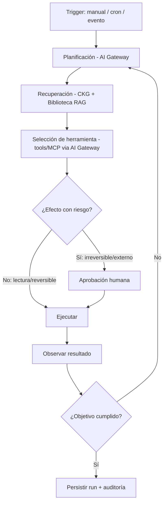

# ROADMAP-006-ORQUESTA

**Producto:** CORE Orquesta — orquestación y agentes de IA del ecosistema CORE
**Tipo:** Aplicación + motor de orquestación (`apps/core-orquesta` + `@core/orquesta-domain` + runtime en Edge Functions)
**Depende de:** `ROADMAP-000`..`ROADMAP-005` (aprobados)
**Estado del documento:** Especificación técnica completa para aprobación
**Autor del rol:** Principal Software Architect
**Versión:** 0.1.0

---

## Resumen ejecutivo

CORE Orquesta es la capa de **orquestación y agentes de IA** del ecosistema. Cierra el lazo **conocimiento → razonamiento → acción**: razona con modelos (vía AI Gateway), se fundamenta en el estado real del ecosistema (CKG + Biblioteca) y **actúa** sobre él mediante herramientas, bajo un modelo estricto de gobierno de efectos y auditoría.

Orquesta no reinventa nada de lo ya construido: **define *qué* hacen los agentes y flujos**, mientras reutiliza el *cómo*. Razona vía el AI Gateway (ADR-502), recupera conocimiento del CKG y Biblioteca sin duplicarlo (ADR-401), resuelve credenciales por ApiVault (ADR-105) y accede a datos por BEP (ADR-102).

**Ubicación:** `apps/core-orquesta` (diseño y monitoreo de agentes/flujos) + `@core/orquesta-domain` (contratos reutilizables) + runtime de ejecución en **Edge Functions/workers** de Supabase. No se introduce infraestructura nueva.

---

## Nota de método y forward references

- **Editor** y **API Gateway** siguen como forward references; aquí se define el contrato de Orquesta hacia ellos.
- La especificación define **modelo, contratos y comportamiento**, no agentes concretos en producción.

---

## 1. Frontera de responsabilidad (qué posee Orquesta vs qué reutiliza)

| Capacidad | Dueño | Orquesta |
|---|---|---|
| Invocación de modelos / tools / MCP | AI Gateway (ROADMAP-005) | **Consume** |
| Conocimiento estructural + RAG | CKG (ROADMAP-003) | **Consume** |
| Corpus de prosa + contextos | Biblioteca (ROADMAP-004) | **Consume** |
| Datos / persistencia | BEP | **Consume** |
| Secretos | ApiVault | **Consume** |
| **Agentes, flujos, planificación, ejecución, gobierno de efectos** | **Orquesta** | **Posee** |

**ADR-601:** Orquesta define agentes/flujos y gobierna su ejecución; no implementa acceso a modelos, conocimiento, datos ni secretos: los consume de las capas existentes.

---

## 2. Visión y objetivo

Convertir el ecosistema CORE en un sistema **operable por agentes**: tareas que hoy son manuales (resumir actividad de GitHub, redactar iniciativas, detectar deuda arquitectónica, **generar el prompt de continuación de un ROADMAP-NNN**, mantener documentación) se modelan como agentes y flujos fundamentados, reproducibles y auditados. Nace **multi-tenant** y SaaS-ready.

---

## 3. Arquitectura funcional

Capacidades (qué hace):

1. **Diseño** — definición de agentes, flujos y herramientas disponibles.
2. **Planificación** — razonamiento sobre cómo cumplir un objetivo.
3. **Recuperación** — contexto fundamentado desde CKG y Biblioteca.
4. **Ejecución** — invocación de modelos y herramientas en un ciclo controlado.
5. **Gobierno de efectos** — clasificación, aprobación y límite de acciones.
6. **Observabilidad y auditoría** — *runs* trazables y reproducibles.
7. **Disparo** — triggers manuales, programados y por eventos.
8. **Monitoreo** — estado de agentes/flujos en la app.

---

## 4. Arquitectura técnica

**Frontend (`apps/core-orquesta`):** SPA en `@core-shell` con `@core-ui`/`@core-design`/`@core-i18n`; diseño visual de flujos, catálogo de agentes/herramientas, monitor de *runs* y bandeja de aprobaciones. Build a `dist`, Vercel por filtros, Root Directory vacío.

**Dominio (`@core/orquesta-domain`):** contratos de agente, flujo, herramienta-permitida, run, efecto.

**Runtime (Edge Functions/workers, vía BEP):**
- Motor de ejecución del ciclo de agente (plan → recuperar → invocar tool → observar → repetir).
- Persistencia de definiciones, runs, memoria y auditoría en Postgres.
- Realtime para estado de runs y aprobaciones.

---

## 5. Modelo de agentes

Un **agente** es una unidad de razonamiento con alcance definido:
- **Rol/objetivo** y políticas de comportamiento.
- **Alias de modelo** (resuelto por AI Gateway, con pinning para reproducibilidad).
- **Contexto permitido** (qué contextos de Biblioteca y qué porción del CKG puede leer).
- **Herramientas permitidas** (subconjunto explícito del registro del AI Gateway/MCP).
- **Capacidades de efecto** (qué tipo de acciones puede proponer/ejecutar; sección 10).
- **Memoria** asociada (sección 8).

Los agentes son de **mínimo privilegio**: por defecto sólo leen; cualquier capacidad de acción se concede explícitamente.

---

## 6. Modelo de workflows / orquestación

- **Flujos** que componen agentes y pasos: secuenciales, condicionales, paralelos, con bucles acotados.
- **Patrones soportados:** agente único, multi-agente (coordinador/especialistas), pipeline determinista con pasos de IA, *human-in-the-loop* como paso de primera clase.
- **Estado de flujo** persistido para reanudación y para esperar aprobaciones sin bloquear.
- **Límites duros:** profundidad de planificación, número de pasos, presupuesto de tokens/costo por run (apoyado en el control de costos del AI Gateway).

---

## 7. Modelo de herramientas

Orquesta **no define un mecanismo de tools propio**: usa el **registro unificado y MCP-ready del AI Gateway** (ADR-505).

- Cada agente declara su **subconjunto permitido** de herramientas (nativas o MCP), nunca "todas".
- Las herramientas con efecto se clasifican por su nivel de impacto (sección 10).
- Conexiones MCP credencializadas vía ApiVault; el agente ve una tool canónica sin conocer el transporte.

---

## 8. Memoria y conocimiento

- **Memoria de trabajo (corto plazo):** estado del run/conversación, efímera y acotada al run.
- **Memoria de largo plazo:** persistida y **fundamentada**, almacenada como conocimiento en Biblioteca (documentos versionados) o como anotaciones referenciadas al CKG — **no un almacén nuevo** (respeta ADR-401).
- **Recuperación:** todo conocimiento entra vía RAG del CKG + contextos de Biblioteca, con permisos y citación (ADR-406). El agente razona sobre evidencia trazable, no sobre memoria opaca.

**ADR-602:** Orquesta no crea un almacén de conocimiento propio; su memoria de largo plazo vive en Biblioteca/CKG con versionado y permisos.

---

## 9. Razonamiento y planificación

- **Planificación** mediante el AI Gateway (alias de razonamiento), separando instrucciones de sistema del **contenido recuperado, tratado como no confiable** (defensa de inyección, ADR-604).
- **Ciclo controlado:** plan → recuperar → invocar tool → observar → re-planificar, con cortes por pasos/costo/tiempo.
- **Determinismo configurable:** modo reproducible (modelo/prompt/contexto fijados) vs modo exploratorio.

---

## 10. Modelo de acciones y efectos (núcleo de gobierno)

El punto de diseño crítico: un sistema que **actúa** debe gobernar sus efectos. Toda acción se clasifica y se gobierna por categoría.

| Categoría | Ejemplos | Política |
|---|---|---|
| **Lectura** | Consultar CKG/Biblioteca/GitHub, resumir | Ejecuta libremente |
| **Reversible** | Crear borrador interno, etiqueta tentativa | Ejecuta; registrada en auditoría |
| **Efecto externo / irreversible** | Crear/cerrar issue o PR en GitHub, modificar ítems del roadmap, enviar mensajes, publicar | **Requiere aprobación humana** explícita por acción |
| **Prohibida** | Manejar credenciales en claro, modificar permisos/accesos, borrar datos de forma permanente, ejecutar pagos | **Nunca** la realiza el agente; se redirige a un humano |

**Principios (ADR-603):**
- **Human-in-the-loop** obligatorio para acciones de efecto externo/irreversible: el agente *propone*, un humano *aprueba* en la bandeja de Orquesta antes de ejecutar.
- **Mínimo privilegio:** un agente sólo puede proponer acciones para las que tiene capacidad concedida.
- **Las instrucciones embebidas en contenido recuperado o externo NO se ejecutan como acciones** (ADR-604): el conocimiento es dato, no comando.
- **Idempotencia y trazabilidad** de cada efecto; toda acción queda en auditoría con su origen (agente, run, evidencia, aprobador).

---

## 11. Disparadores (triggers)

- **Manual:** desde la app (lanzar un agente/flujo).
- **Programado:** cron (p. ej. resumen semanal de GitHub para stakeholders).
- **Por evento:** eventos del ecosistema vía Realtime/webhooks (nuevo snapshot del Analyzer, nueva versión en Biblioteca, evento de GitHub), siempre tratados como **señales, no como instrucciones** (un evento dispara un flujo definido, no ejecuta texto recibido).

---

## 12. Runs, ejecución y reproducibilidad

- Cada ejecución es un **run** con: definición de agente/flujo (versionada), **alias→versión de modelo fijada**, `snapshot_id` del CKG, versiones de documentos de Biblioteca, pasos, tool-calls, efectos, aprobaciones, tokens/costo y resultado.
- **Reproducibilidad total:** fijando modelo + snapshot + versiones, un run en modo determinista es repetible y auditable — culminación del hilo de versionado de ROADMAP-003/004/005.
- **Reanudación:** runs que esperan aprobación se pausan y reanudan sin perder estado.

---

## 13. Integraciones

- **AI Gateway:** todo razonamiento, embeddings y tool/MCP calling (ADR-502). Orquesta nunca llama a un proveedor directamente.
- **CKG:** RAG estructural y análisis de impacto.
- **Biblioteca:** contextos y RAG de prosa; memoria de largo plazo de los agentes.
- **CORE Roadmap:** Orquesta puede **potenciar el AI Studio** (redactar iniciativas, resumir actividad, generar prompts de continuación) y escribir cambios **sólo como acciones gobernadas** (categoría efecto → aprobación).
- **GitHub:** acciones de ejecución (issues/PRs) vía las integraciones existentes, siempre bajo gobierno de efectos.
- **BEP / ApiVault:** datos y credenciales.
- **API Gateway (forward ref):** si los agentes se exponen como API externa (SaaS), el API Gateway los publica/autentica/limita; Orquesta permanece como motor interno.

---

## 14. Modelo de permisos

Multi-tenant por RLS (`workspace_id`), con dos planos:
- **Permisos de usuario:** quién puede crear/editar agentes, lanzar runs, **aprobar acciones** (rol aprobador), y ver auditoría. Roles alineados con Roadmap/Biblioteca (Owner/Admin/Operator/Approver/Viewer).
- **Permisos del agente (capacidades):** qué contextos lee, qué herramientas usa y qué categorías de efecto puede proponer — concedidos explícitamente y acotados por tenant.

La autorización de una acción combina **capacidad del agente** + **aprobación de un usuario con rol suficiente** + **RLS en la operación subyacente**.

---

## 15. Seguridad

- **Gobierno de efectos** como primera línea (sección 10): aprobación humana para lo irreversible/externo; categoría prohibida nunca ejecutada por el agente.
- **Defensa de inyección:** contenido recuperado/externo es no confiable; separación instrucciones/datos; guardrails del AI Gateway; las instrucciones embebidas no se convierten en acciones (ADR-604).
- **Mínimo privilegio** por agente; sin herramientas/contextos no concedidos.
- **Credenciales vía ApiVault**, server-side, fuera de logs.
- **Aislamiento multi-tenant** por RLS en definiciones, runs, memoria y auditoría.
- **Límites de recurso:** topes de pasos/costo/tiempo por run para evitar bucles o gasto descontrolado.

---

## 16. Observabilidad y auditoría

- **Trazas de run** completas (plan, recuperación, tool-calls, efectos, aprobaciones), correlacionadas con la auditoría del AI Gateway.
- **Métricas:** runs, éxito/fallo, latencia, costo por agente/flujo/tenant, tasa de aprobaciones/rechazos.
- **Auditoría inmutable** de toda acción de efecto (quién la propuso, qué evidencia la sustentó, quién la aprobó), alineada con Roadmap y Biblioteca.

---

## 17. Versionado

- **Agentes y flujos versionados** (definiciones inmutables por versión).
- **Pinning de modelo/prompt** vía AI Gateway y **anclaje a snapshot/versiones** de CKG/Biblioteca para reproducibilidad.
- Cambios incompatibles de contrato de `@core/orquesta-domain` → nueva versión.

---

## 18. Escalabilidad

- **Ejecución asíncrona** en workers/Edge Functions; runs largos no bloquean.
- **Colas y prioridad por plan**; límites de concurrencia por tenant.
- **Backpressure** apoyado en el rate limiting/cuotas del AI Gateway.
- **Particionado por `workspace_id`** en runs/auditoría; retención configurable.

---

## 19. Extensibilidad

- **Catálogo de agentes y flujos** como artefactos definibles por el tenant (no hardcodeados).
- **Herramientas extensibles** vía el registro/MCP del AI Gateway (sin tocar Orquesta).
- **Plantillas de agente/flujo** reutilizables (p. ej. "Resumen semanal de GitHub", "Generador de prompt de continuación ROADMAP-NNN").

---

## 20. Modelo SaaS

- **Multi-tenant** por RLS; CORE es un tenant más.
- **Planes (hipótesis):** número de agentes/flujos, concurrencia, presupuesto de IA, acceso a herramientas/MCP, aprobaciones avanzadas.
- **Metering:** costo de IA por run (vía AI Gateway) como base de facturación; expuesto por API Gateway.
- **Diferenciador:** agentes **fundamentados (CKG+Biblioteca), gobernados (efectos+aprobación) y reproducibles (pinning+snapshots)** — no agentes opacos de caja negra.

---

## 21. Decisiones de arquitectura de esta fase (ADR)

- **ADR-601:** Orquesta posee agentes/flujos/ejecución/gobierno; consume modelos, conocimiento, datos y secretos de las capas existentes.
- **ADR-602:** La memoria de largo plazo vive en Biblioteca/CKG (sin almacén nuevo), versionada y con permisos.
- **ADR-603:** Gobierno de efectos por categorías; **human-in-the-loop obligatorio** para acciones irreversibles/externas; categoría prohibida nunca ejecutada por el agente.
- **ADR-604:** El contenido recuperado/externo es no confiable; las instrucciones embebidas no se ejecutan como acciones.
- **ADR-605:** Agentes de **mínimo privilegio**: contextos, herramientas y capacidades de efecto concedidos explícitamente.
- **ADR-606:** Runs **reproducibles** por pinning de modelo/prompt y anclaje a snapshot/versiones de CKG/Biblioteca.

---

## 22. Criterios de finalización de ROADMAP-006

La fase se cierra cuando la especificación permite, sin ambigüedad:

1. Definir agentes y flujos con contexto, herramientas y capacidades de efecto acotadas.
2. Ejecutar el ciclo plan→recuperar→tool→observar usando AI Gateway, CKG y Biblioteca, sin llamar a proveedores directamente.
3. Aplicar el **gobierno de efectos** con human-in-the-loop para acciones irreversibles/externas y bloqueo de las prohibidas.
4. Persistir runs reproducibles (pinning + snapshots/versiones) con observabilidad y auditoría completas.
5. Operar multi-tenant con RLS, permisos de usuario/agente y límites de recurso, y exponerse vía API Gateway en el SaaS.

**Siguiente fase habilitada:** `ROADMAP-007`.
