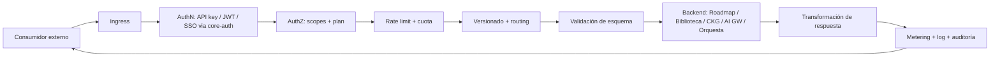

# ROADMAP-007-API-GATEWAY

**Componente:** CORE API Gateway — puerta única de exposición de las APIs del ecosistema
**Tipo:** Servicio de ingress / API edge (`@core/api-gateway` + runtime en Edge/Serverless Functions)
**Depende de:** `ROADMAP-000`..`ROADMAP-006` (aprobados)
**Estado del documento:** Especificación técnica completa para aprobación
**Autor del rol:** Principal Software Architect
**Versión:** 0.1.0

---

## Resumen ejecutivo

CORE API Gateway es la **única puerta de entrada externa** al ecosistema CORE: el punto *north-bound* por el que consumidores externos (clientes SaaS, integraciones, apps de terceros) acceden a las capacidades de CORE Roadmap, Biblioteca, CKG, AI Gateway y Orquesta. Centraliza autenticación, autorización, rate limiting, cuotas, versionado de API, validación, observabilidad y **metering por tenant** — la base operativa del modelo SaaS.

Es el complemento simétrico del **AI Gateway** (ROADMAP-005): aquel es *south-bound* (CORE → proveedores de IA); este es *north-bound* (mundo → CORE). Junto con la tríada BEP/ApiVault/AI Gateway, completa la disciplina de **puntos únicos** del ecosistema.

**Ubicación:** `@core/api-gateway` (contratos/políticas) + runtime de ingress realizado sobre **Edge/Serverless Functions existentes** (Vercel/Supabase), respaldado por Postgres vía BEP. No es un appliance nuevo: es una **capa lógica de gateway** sobre la infraestructura ya en uso (ADR-701). No se introduce infraestructura nueva.

---

## Nota de método y forward references

- Este componente **realiza** el "API Gateway" que quedó como forward reference en ROADMAP-004/005/006.
- **Editor** sigue como forward reference.
- La especificación define **modelo, contratos y comportamiento**, no integraciones con clientes reales.

---

## 1. Frontera: API Gateway vs AI Gateway vs ApiVault

| Aspecto | API Gateway (esta fase) | AI Gateway (ROADMAP-005) | ApiVault |
|---|---|---|---|
| Dirección | North-bound (entrada externa) | South-bound (egress de IA) | — |
| Gestiona | Acceso de consumidores a CORE | Llamadas de CORE a proveedores de IA | Secretos que CORE consume |
| Claves | **Emite y valida** claves de API de clientes | Resuelve claves de proveedor (vía ApiVault) | Almacena secretos de terceros |

**ADR-702:** El API Gateway gestiona el **ciclo de vida de las claves de API que CORE emite a sus consumidores** (distintas de los secretos de terceros que viven en ApiVault). Los secretos que el propio Gateway necesita (p. ej. claves de firma) sí se guardan en ApiVault.

---

## 2. Visión y objetivo

Exponer el ecosistema CORE como un **producto de plataforma**: una superficie de API unificada, segura, versionada y medida, que permita a clientes e integraciones consumir Roadmap, Biblioteca, conocimiento (CKG), IA (vía AI Gateway) y agentes (Orquesta) sin acoplarse a la implementación interna. Habilita la **comercialización SaaS** con autenticación, planes, cuotas y facturación por uso.

---

## 3. Arquitectura funcional

Capacidades (qué hace):

1. **Ingress unificado** — un único punto de entrada para todas las APIs.
2. **Autenticación** — claves de API, tokens/JWT, SSO (enterprise), delegando identidad en `@core-auth`.
3. **Autorización** — scopes, planes y permisos por tenant.
4. **Rate limiting y cuotas** — por tenant/plan/clave/ruta.
5. **Routing y versionado** — enrutamiento a servicios backend y gestión de versiones de API.
6. **Validación y transformación** — de requests/responses contra esquemas.
7. **Metering** — contabilidad de uso por tenant para facturación.
8. **Observabilidad y auditoría** — logs, métricas, trazas.
9. **Portal de desarrolladores** — catálogo de API y documentación.

---

## 4. Arquitectura técnica

- **Capa de ingress** sobre Edge/Serverless Functions: intercepta toda petición externa antes de alcanzar los servicios.
- **Pipeline de políticas** ejecutado por petición: autenticación → autorización → rate limit/cuota → versionado/routing → validación → invocación backend → transformación → metering/log.
- **Backends:** servicios internos del ecosistema (Roadmap, Biblioteca, CKG, AI Gateway, Orquesta), accedidos por contratos internos.
- **Persistencia vía BEP:** configuración de API, claves emitidas (hasheadas), scopes, planes, contadores de uso, logs y auditoría; RLS por `workspace_id`.
- **Realtime** para alertas de cuota/abuso.

---

## 5. Autenticación y autorización

- **Métodos:** claves de API (server-to-server), tokens/JWT (apps), SSO/OIDC (enterprise) — todo apoyado en `@core-auth` como autoridad de identidad.
- **Propagación de identidad/tenant:** el Gateway valida y propaga `workspace_id` + identidad a los backends, que confían en esa propagación (alineado con ADR-405 de Biblioteca).
- **Autorización por scopes y plan:** cada clave/credencial tiene scopes (qué APIs/operaciones) y un plan (qué límites). La decisión combina scope + plan + RLS en la operación final.

---

## 6. Gestión de claves de API

- **Emisión** de claves por tenant con scopes y vencimiento; almacenadas **hasheadas** (nunca en claro) vía BEP.
- **Rotación y revocación** self-service; múltiples claves por tenant (p. ej. por entorno).
- **Secretos de firma del Gateway** (para tokens) guardados en **ApiVault** (ADR-702).
- **Principio:** el Gateway **emite/valida** sus propias claves; no confunde esto con los secretos de terceros que consume CORE (ApiVault).

---

## 7. Rate limiting y cuotas

- **Límites por tenant/plan/clave/ruta**, con algoritmo token-bucket; ventanas configurables.
- **Cuotas de uso** por periodo (mensuales por plan), con límites *soft* (alerta) y *hard* (bloqueo).
- **Backpressure y colas** donde aplica; respuestas con códigos y cabeceras estándar de límite restante.
- **Coordinación con backends:** las cuotas de IA/Orquesta del Gateway se alinean con el control de costos del AI Gateway y los límites de Orquesta, evitando doble contabilidad.

---

## 8. Versionado de API

- **Versionado explícito** (por path o cabecera), con múltiples versiones activas en paralelo.
- **Ciclo de vida:** disponible → deprecada (con cabeceras/avisos) → retirada, con ventanas de migración.
- **Contratos estables:** los esquemas de cada versión son inmutables; cambios incompatibles → nueva versión.
- **Desacople de la implementación interna:** un cambio interno no rompe la API pública si el contrato de versión se mantiene.

---

## 9. Validación y transformación

- **Validación de esquema** de requests/responses (rechazo temprano de payloads inválidos).
- **Transformación** entre el contrato público y los contratos internos de los backends (el cliente no ve la forma interna).
- **Normalización de errores:** formato de error unificado y consistente en todas las APIs.

---

## 10. Metering y facturación

Punto de **convergencia de uso del ecosistema** para el SaaS:
- Contabiliza llamadas, datos y, vía backends, **costo de IA (AI Gateway)** y **runs de Orquesta**.
- Unifica el metering por tenant/plan como base de **facturación**; expone uso al cliente (portal) y a finanzas.
- Evita doble conteo coordinando con las métricas de costo ya existentes en AI Gateway/Orquesta.

**ADR-703:** El API Gateway es el punto de **agregación de metering por tenant** para facturación SaaS; los costos de IA y de agentes se consolidan aquí desde sus fuentes (AI Gateway, Orquesta) sin recalcularlos.

---

## 11. Integraciones

- **Backends del ecosistema:** publica las capacidades de Roadmap, Biblioteca, CKG, AI Gateway y Orquesta como APIs externas versionadas.
- **`@core-auth`:** autoridad de identidad/SSO.
- **ApiVault:** secretos de firma del Gateway.
- **BEP:** persistencia de config, claves, planes, uso, logs (RLS).
- **Biblioteca (portal de desarrolladores):** la documentación de API puede gestionarse como conocimiento en Biblioteca y servirse en el portal (reutilización, sin duplicar).
- **Editor (forward ref):** autoría de la documentación de API/portal.

---

## 12. Modelo de permisos

Multi-tenant por RLS (`workspace_id`), dos planos:
- **Permisos administrativos:** quién gestiona claves, planes, scopes y ve uso/auditoría (Owner/Admin).
- **Permisos del consumidor externo:** definidos por los **scopes y el plan** de su clave/credencial; nunca acceden fuera de su tenant.

La decisión de acceso final combina scope + plan + RLS del backend, manteniendo defensa en profundidad.

---

## 13. Seguridad

- **Borde endurecido:** validación estricta de entrada, límites de tamaño, protección anti-abuso/DDoS-básico (rate limit/cuota), normalización de errores sin filtrar internals.
- **Sin exposición de internals:** los backends sólo se alcanzan a través del Gateway; la forma interna nunca se expone.
- **Claves hasheadas**, secretos de firma en ApiVault, TLS extremo a extremo.
- **Aislamiento multi-tenant** por RLS en toda config/uso/auditoría.
- **Defensa de inyección:** el payload externo es no confiable; validación de esquema y saneo antes de llegar a backends (especialmente relevante para entradas que alimentan IA/Orquesta).
- **Auditoría** de accesos, emisión/uso de claves y operaciones sensibles.

---

## 14. Escalabilidad

- **Edge/serverless** con escalado horizontal natural; sin estado en el borde (estado en Postgres/contadores).
- **Contadores de rate/cuota** eficientes y particionados por tenant.
- **Caché** de respuestas idempotentes donde aplica.
- **Degradación controlada:** si un backend se satura, el Gateway aplica límites y respuestas claras sin caída en cascada.

---

## 15. Extensibilidad

- **Nuevas APIs** se publican declarando ruta, versión, scopes, esquema y backend — sin reescribir el Gateway.
- **Políticas como plugins** (auth adicional, transformaciones, reglas de cuota) configurables por ruta/tenant.
- **Planes configurables** (límites/scopes) sin cambios de código.

---

## 16. Modelo SaaS

- **Multi-tenant** por RLS; CORE es un tenant más.
- **Planes** con scopes, cuotas y límites diferenciados; self-service de claves.
- **Metering→billing** unificado (sección 10) como motor de monetización de todo el ecosistema.
- **Portal de desarrolladores:** catálogo de API, claves, uso y documentación (servida desde Biblioteca).
- **Diferenciador:** una sola superficie de API gobernada que expone *roadmap + conocimiento + IA + agentes* con auth, versionado, cuotas y facturación integradas.

---

## 17. Decisiones de arquitectura de esta fase (ADR)

- **ADR-701:** El API Gateway es una **capa lógica** sobre Edge/Serverless existente, no un appliance nuevo (respeta "no inventar infraestructura").
- **ADR-702:** El Gateway **emite y valida** las claves de API de los consumidores (hasheadas, vía BEP); sus secretos de firma viven en ApiVault — distinto de los secretos de terceros que ApiVault custodia.
- **ADR-703:** Es el punto de **agregación de metering por tenant** para facturación; consolida costos de IA (AI Gateway) y runs (Orquesta) sin recalcularlos.
- **ADR-704:** Es el **único ingress externo**; los backends no se exponen directamente y confían en la identidad/tenant propagada por el Gateway.
- **ADR-705:** Versionado explícito con contratos inmutables por versión y ciclo de vida de deprecación; la implementación interna queda desacoplada de la API pública.
- **ADR-706:** Todo payload externo es no confiable: validación de esquema y saneo antes de alcanzar backends (en especial los que alimentan IA/Orquesta).

---

## 18. Criterios de finalización de ROADMAP-007

La fase se cierra cuando la especificación permite, sin ambigüedad:

1. Exponer las capacidades de Roadmap, Biblioteca, CKG, AI Gateway y Orquesta como APIs externas versionadas a través de un ingress único.
2. Autenticar (claves/JWT/SSO vía `@core-auth`), autorizar por scopes/plan y propagar identidad/tenant a los backends.
3. Aplicar rate limiting, cuotas y versionado con contratos estables, validación y normalización de errores.
4. Gestionar el ciclo de vida de claves de API (emisión/rotación/revocación) y consolidar metering por tenant para facturación.
5. Operar multi-tenant con RLS, seguridad de borde, observabilidad y auditoría completas.

**Siguiente fase habilitada:** `ROADMAP-008`.
